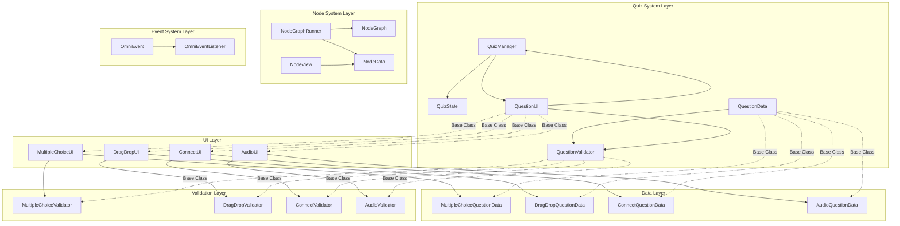
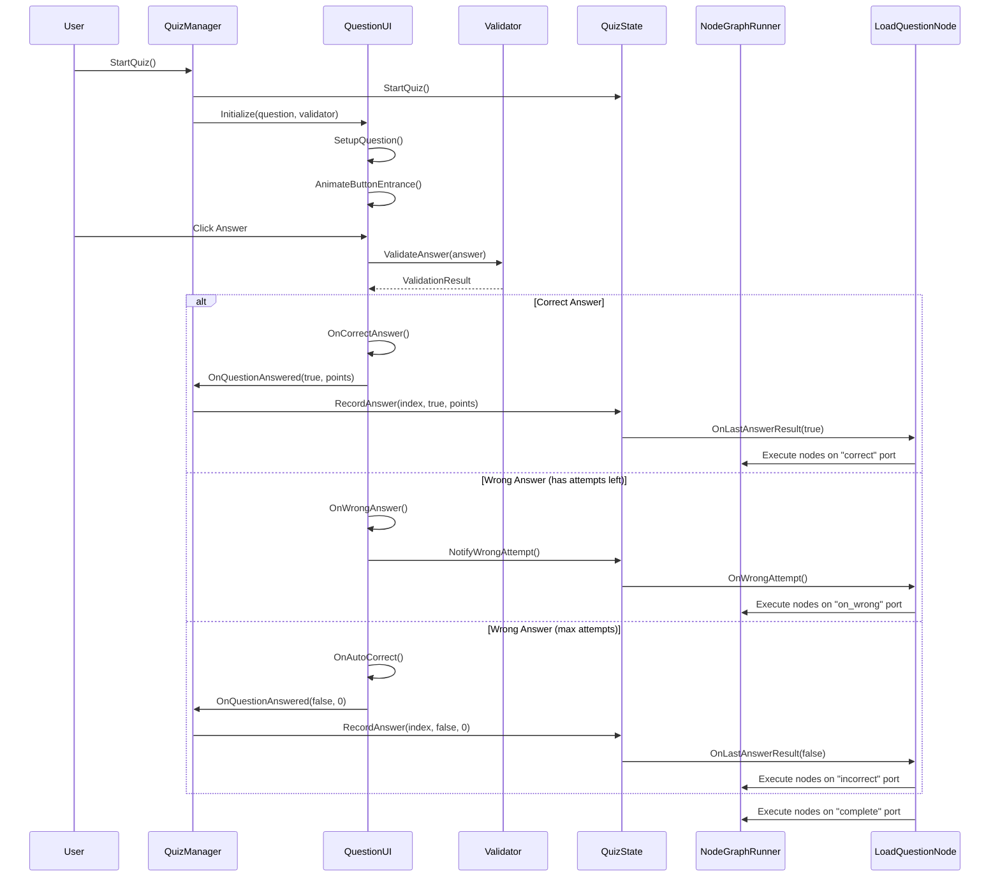

# Quiz Master - Scripts Folder Analysis

## Project Overview

This is a **Unity-based Quiz System** with a **visual node-based flow control system** (Node Flow) for creating interactive quizzes. The project combines traditional quiz functionality with a powerful visual scripting system for creating complex quiz flows.

---

## Architecture Diagram



---

## Directory Structure

```
Assets/scripts/
├── Animations/          # Animation helpers for quiz transitions and feedback
├── Data/                # Question data ScriptableObjects (10 question types)
├── Editor/              # Custom editor tools (empty in current structure)
├── Nodes/               # Node system nodes (empty - nodes are in NodeSystem/)
├── NodeSystem/          # Core visual node graph system
│   ├── Core/           # NodeGraph, NodeGraphRunner, NodeData
│   ├── Editor/         # NodeGraphEditorWindow, NodeView, styles
│   ├── Integration/     # Quiz-NodeSystem bridge
│   └── Nodes/          # All node implementations (20+ nodes)
├── OmniEvent/          # Enhanced UnityEvent system (0-4 args, complex types)
│   ├── Core/           # OmniEvent, OmniEventListener
│   ├── Editor/         # Inspector drawers
│   ├── Examples/       # Usage examples
│   └── UI/             # OmniButton, OmniSlider, etc.
├── UI/                 # Quiz UI components and QuizManager
└── Validation/         # Question validators (one per question type)
```

---

## Core Systems

### 1. Quiz System (`QuizSystem` namespace)

#### **QuizManager.cs** (479 lines)
Main quiz controller that manages question flow.

**Key Features:**
- Question list management with optional shuffling
- 10 question type support (prefab-based UI instantiation)
- Transition animations (Fade, Slide, Scale) using DOTween
- Score tracking and attempt counting
- Integration with QuizState for event broadcasting

**Public Methods:**
- `StartQuiz()` - Initialize and start quiz
- `NextQuestion()` / `PreviousQuestion()` - Navigation
- `OnQuestionAnswered(bool, int)` - Handle answer submission

**UI Prefabs Required:**
- `trueFalseUIPrefab`, `fillInTheBlankUIPrefab`, `multiSelectUIPrefab`
- `orderingUIPrefab`, `hotspotUIPrefab`, `sliderUIPrefab`
- `audioUIPrefab`, `multipleChoiceUIPrefab`
- `dragDropUIPrefab`, `connectUIPrefab`

---

#### **QuizState.cs** (235 lines)
Singleton state manager for quiz progress and events.

**State Properties:**
- Progress: `totalQuestions`, `questionsAnswered`, `correctAnswers`, `wrongAnswers`
- Score: `currentScore`, `maxPossibleScore`
- Last Answer: `lastAnswerWasCorrect`, `lastQuestionIndex`, streaks
- Timer: `timerDuration`, `timerRemaining`, `timerActive`
- Quiz Status: `quizActive`, `quizCompleted`
- Animations: `currentAnswerAnimations` (for node system integration)

**Events:**
- `OnScoreChanged` - Fired when score changes
- `OnQuestionAnswered` - Fired when question completes
- `OnLastAnswerResult` - Fired when answer is finalized (correct or auto-correct)
- `OnWrongAttempt` - Fired on each wrong answer (for VFX/sounds)
- `OnQuizStarted` / `OnQuizCompleted` - Quiz lifecycle
- `OnTimerTick` - Timer updates

**Computed Properties:**
- `ScorePercentage`, `CorrectPercentage`, `ProgressPercentage`
- `RemainingQuestions`, `TimerExpired`

---

#### **QuestionUI.cs** (247 lines)
Abstract base class for all question UI implementations.

**Common UI Elements:**
- `questionText` (TextMeshProUGUI)
- `hintText` (TextMeshProUGUI)
- `attemptCounterText` (TextMeshProUGUI)
- `hintPanel` (GameObject)
- `submitButton` (Button - optional for auto-submit types)

**Abstract Methods:**
- `SetupQuestion()` - Initialize question-specific UI
- `OnAnswerSubmitted()` - Handle answer submission
- `GetCorrectAnswerDisplay()` - Return correct answer for auto-correct

**Feedback Methods:**
- `OnCorrectAnswer()` - Scale bounce animation
- `OnWrongAnswer()` - Shake animation
- `OnAutoCorrect()` - Show correct answer with explanation
- `ShowHint()` - Animate hint panel reveal

**Animation Support:**
- DOTween-based feedback animations
- Configurable `feedbackDuration`
- Animation preview button for editor

---

### 2. Data Layer (`Data/` folder)

#### **QuestionData.cs** (60 lines)
Abstract base class for all question types.

**Common Properties:**
- `questionText` - The question prompt
- `questionType` - Enum (10 types)
- `hints[]` - Array of hints (one per wrong attempt)
- `maxAttempts` - Maximum attempts before auto-correct (1-10)
- `points` - Points awarded for correct answer
- `explanation` - Explanation shown after answering

**Validation Button:**
- `ValidateQuestion()` - Checks for empty question text and missing hints

---

#### **QuestionType.cs** (17 lines)
Enum defining all supported question types:
- `MultipleChoice` - 4 options, select one
- `DragDrop` - Drag items to targets
- `Connect` - Connect matching pairs
- `TrueFalse` - Boolean choice
- `FillInTheBlank` - Text input
- `MultiSelect` - Select multiple options
- `Ordering` - Arrange items in order
- `Hotspot` - Click on image regions
- `Slider` - Value selection on slider
- `Audio` - Audio-based question

---

#### **Question Data Types** (10 implementations)

| File | Lines | Key Properties |
|------|-------|---------------|
| `MultipleChoiceQuestionData.cs` | 54 | `answers[4]`, `correctAnswerIndex` |
| `TrueFalseQuestionData.cs` | 823 | `isCorrect` |
| `FillInTheBlankQuestionData.cs` | 3334 | `correctAnswer`, `caseSensitive` |
| `MultiSelectQuestionData.cs` | 1638 | `answers[]`, `correctIndices[]` |
| `OrderingQuestionData.cs` | 2634 | `items[]`, `correctOrder[]` |
| `SliderQuestionData.cs` | 2477 | `minValue`, `maxValue`, `correctRange` |
| `HotspotQuestionData.cs` | 3769 | `hotspots[]` (rects), `correctHotspotIndex` |
| `DragDropQuestionData.cs` | 2916 | `draggables[]`, `dropZones[]`, `correctMappings` |
| `ConnectQuestionData.cs` | 2743 | `leftItems[]`, `rightItems[]`, `correctPairs` |
| `AudioQuestionData.cs` | 2597 | `audioClip`, `questionType` (embedded) |

All use **Odin Inspector** for enhanced editor experience with `[BoxGroup]`, `[InfoBox]`, `[TableList]`, `[ValueDropdown]`, `[ValidateInput]` attributes.

---

### 3. Validation Layer (`Validation/` folder)

#### **IQuestionValidator.cs** (26 lines)
Interface defining validation contract.

**Methods:**
- `ValidateAnswer(object answer)` - Returns `ValidationResult`
- `GetHint(int attemptNumber)` - Get hint for specific attempt
- `HasReachedMaxAttempts()` - Check if max attempts exceeded
- `GetCurrentAttempt()` - Get current attempt count
- `Reset()` - Reset validator state

**ValidationResult Class:**
- `IsCorrect` - Whether answer is correct
- `Message` - Feedback message
- `ShouldAutoCorrect` - Whether to show correct answer

---

#### **Validator Implementations** (10 validators)

| File | Lines | Validates |
|------|-------|-----------|
| `MultipleChoiceValidator.cs` | 30 | Integer index against `correctAnswerIndex` |
| `TrueFalseValidator.cs` | ~900 | Boolean against `isCorrect` |
| `FillInTheBlankValidator.cs` | ~850 | String match with optional case sensitivity |
| `MultiSelectValidator.cs` | ~1920 | Array of indices against `correctIndices[]` |
| `OrderingValidator.cs` | ~2200 | Array order against `correctOrder[]` |
| `SliderValidator.cs` | ~1800 | Float value within `correctRange` |
| `HotspotValidator.cs` | ~2170 | Vector2 position within hotspot rect |
| `DragDropValidator.cs` | ~2260 | Drag-drop mapping correctness |
| `ConnectValidator.cs` | ~2318 | Connection pair correctness |
| `AudioValidator.cs` | ~1710 | Audio-based validation |

All validators inherit from `QuestionValidator` base class which implements `HandleWrongAnswer()` to provide hints and track attempts.

---

#### **ValidatorFactory.cs** (1624 lines)
Factory pattern for creating appropriate validators.

**Method:**
```csharp
public static IQuestionValidator CreateValidator(QuestionData question)
```

Returns validator based on `question.questionType` enum.

---

### 4. UI Layer (`UI/` folder)

#### **UI Implementations** (10 components)

| File | Lines | Key Features |
|------|-------|--------------|
| `MultipleChoiceUI.cs` | 399 | 4 buttons, auto-submit, entrance animations |
| `TrueFalseUI.cs` | 1832 | 2 buttons (True/False) |
| `FillInTheBlankUI.cs` | 2023 | Input field, submit button |
| `MultiSelectUI.cs` | 3734 | Multiple toggles, submit button |
| `OrderingUI.cs` | 5507 | Draggable items, drag-drop reordering |
| `SliderUI.cs` | 3527 | Slider component, value display |
| `HotspotUI.cs` | 4318 | Image with clickable hotspots |
| `DragDropUI.cs` | 11024 | Complex drag-drop system |
| `ConnectUI.cs` | 11123 | Line drawing for connections |
| `AudioUI.cs` | 7271 | Audio playback, question display |

All inherit from [`QuestionUI`](Assets/scripts/UI/QuestionUI.cs:9) and implement:
- `SetupQuestion()` - Initialize UI with question data
- `OnAnswerSubmitted()` - Handle answer submission
- `GetCorrectAnswerDisplay()` - Return correct answer string

---

### 5. Node System (`NodeSystem/` namespace)

#### **Core Components**

##### **NodeGraph.cs** (548 lines)
ScriptableObject that stores node graph data.

**Storage:**
- `_jsonData` - Single JSON string for all graph data (most reliable serialization)
- `_nodeEvents` - List of UnityEvents (cannot be JSON serialized)
- Runtime caches: `_runtimeNodes`, `_runtimeConnections`, `_runtimeVariables`

**Key Methods:**
- `SaveToJson()` - Serialize runtime data to JSON
- `EnsureLoaded()` - Lazy deserialization from JSON
- `GetNode(string guid)` - Find node by GUID
- `GetEntryNode()` - Find StartNode
- `GetConnectedNodes(string nodeGuid, string outputPortId)` - Get connected nodes
- `AddNode()` / `RemoveNode()` - Node management
- `AddConnection()` / `RemoveConnection()` - Connection management
- `GetVariable()` / `GetOrCreateVariable()` - Variable management
- `Validate()` - Check graph integrity

**Important:** `OnEnable()` only reloads from JSON when `_runtimeNodes` is null to preserve in-memory editor changes.

---

##### **NodeGraphRunner.cs** (586 lines)
MonoBehaviour that executes node graphs at runtime.

**Key Features:**
- Sequential and parallel node execution
- Breakpoint support for debugging
- Pause/Resume/Step debugging
- Active node tracking for parallel execution
- UnityEvent integration (scene + asset events)

**Public Methods:**
- `Run()` - Start graph execution
- `Stop()` - Stop graph execution
- `Pause()` / `Resume()` / `Step()` - Debug controls
- `ExecuteNode(NodeData)` - Execute specific node

**Static Events (for editor visualization):**
- `OnNodeStarted` / `OnNodeCompleted` - Node lifecycle
- `OnGraphStarted` / `OnGraphEnded` - Graph lifecycle

**Special Node Handling:**
- `RandomBranchNode` - Executes only selected node
- `WaitForAllNode` - Synchronization point
- `ConditionalNode` / `QuizBranchNode` - Branching based on state
- Question nodes - Special port handling (correct/incorrect/on_wrong/complete)

---

##### **NodeData.cs** (180 lines)
Abstract base class for all nodes.

**Properties:**
- `Guid` - Unique identifier
- `Position` - Editor position
- `Name` - Display name (abstract)
- `Color` - Editor color (virtual, default gray)
- `Category` - Search menu category (virtual, default "General")
- `State` - Runtime state (Idle, Running, Completed, Failed)
- `Runner` - Runtime executor reference
- `OnComplete` - Completion callback
- `hasBreakpoint` - Editor breakpoint flag
- `displayLabel` - Custom label

**Abstract Methods:**
- `GetInputPorts()` - Define input ports
- `GetOutputPorts()` - Define output ports
- `OnExecute()` - Implement node logic

**Port Capacity Logic:**
- Output ports default to `Multi` (one-to-many)
- Input ports default to `Single` (many-to-one)

---

#### **Editor Components**

##### **NodeGraphEditorWindow.cs**
Main editor window for editing graphs.

**Features:**
- Hosts `NodeGraphView` instance
- Graph selection and breadcrumb navigation
- Toolbar buttons (New, Save)
- Session state persistence (view position, zoom)
- Runtime event subscription for visualization
- Play mode change handling

---

##### **NodeGraphView.cs**
Core GraphView implementation.

**Responsibilities:**
- Loading/unloading graphs
- Creating `NodeView` elements
- Custom Doozy-style edges with traveling dots
- Selection, deletion, undo/redo
- Zoom and panning
- Node search window integration
- Drag from port to empty space → show node menu
- Runtime visualization (node glow, edge highlighting)

**Runtime State Classes:**
- `.node-running` - Blue glow
- `.node-completed` - Completed state
- `.edge-active` - Cyan with traveling dot
- `.edge-executed` - Executed state

---

##### **NodeView.cs** (24046 lines)
Visual representation of a single node.

**Features:**
- Title, color, and display label
- Port creation using `Port.Create<DoozyStyleEdge>()`
- Inline content hosting via `NodeInlineContent` system
- Runtime visual state (glow, color changes)
- Cleanup on play mode exit

**Odin Integration:**
- `NodeViewOdin.cs` (8982 lines) - Odin Inspector integration for node properties

---

##### **NodeInlineContent/**
Inline UI system for node properties.

**Base Class:**
- `NodeInlineContentBase` - Helper for building small UI blocks

**Factory:**
- `NodeInlineContentFactory` - Maps node types to content providers

**Examples:**
- `RandomBranchNodeInlineContent` - Weight sliders with percentages
- `LoopNodeInlineContent` - Loop configuration

---

##### **NodeGraphStyles.uss**
USS stylesheet for node graph editor.

**Defines:**
- Node background colors and header styles
- Glow element `#node-glow` (size, border, animation)
- Selection border `#selection-border`
- Runtime state classes (`.node-running`, `.node-completed`, `.edge-active`, `.edge-executed`)

---

##### **DoozyStyleEdge.cs**
Custom edge implementation for Doozy-style connections.

**Features:**
- Smooth bezier curves with adjusted tangents
- Layered strokes (outline + main color)
- Animated traveling dot
- Different colors for normal/active/executed states
- Manual hit-testing for easy selection

---

#### **Node Implementations** (20+ nodes)

##### **Utility Nodes**

| Node | Description |
|------|-------------|
| `StartNode` | Entry point for graph execution |
| `EndNode` | Graph termination point |
| `DebugLogNode` | Log message to console |
| `DelayNode` | Wait for specified duration |
| `CommentNode` | Visual notes in graph |

---

##### **Flow Control Nodes**

| Node | Description |
|------|-------------|
| `ConditionalNode` | Branch based on condition (true/false ports) |
| `RandomBranchNode` | Weighted random branch selection |
| `LoopNode` | Loop body multiple times (Count/Condition/Infinite) |
| `SubGraphNode` | Execute another graph as sub-graph |

---

##### **Math/Utility Nodes**

| Node | Description |
|------|-------------|
| `MathOperationNode` | Compute A op B (Add/Subtract/Multiply/Divide/Modulo) |
| `RandomFloatNode` | Generate random float in range |
| `RandomIntNode` | Generate random int in range |

---

##### **Scene/UI Nodes**

| Node | Description |
|------|-------------|
| `SceneNode` | Load scene by name/build index |
| `SetActiveNode` | Set GameObject active state |
| `SetTextNode` | Set TextMeshPro text |
| `ButtonActionNode` | Invoke button onClick |
| `ButtonActivationNode` | Set button interactable |

---

##### **Animation Nodes**

| Node | Description |
|------|-------------|
| `AnimationNode` | Play animation on Animator |
| `AnimationSequencerNode` | Sequence multiple animations |

---

##### **Quiz Nodes**

| Node | Lines | Description |
|------|-------|-------------|
| `LoadQuestionNode.cs` | 292 | Load question from asset, wait for answer, support answer animations |
| `CheckAnswerNode.cs` | 2607 | Check answer correctness |
| `EndQuizNode.cs` | 2728 | End quiz with optional performance branching |
| `AnswerAnimationSettings.cs` | 1639 | Animation settings for answer buttons |

**LoadQuestionNode Ports:**
- `correct` - Execute when answer is correct
- `incorrect` - Execute when answer is incorrect (after all attempts)
- `on_wrong` - Execute on each wrong attempt (for VFX/sounds)
- `complete` - Always execute after question completes

**Answer Animation Types:**
- `None`, `Scale`, `Bounce`, `Fade`, `SlideFromLeft`, `SlideFromRight`, `SlideFromTop`, `SlideFromBottom`, `Rotate`

---

#### **Integration**

##### **QuizGraphBridge.cs** (3592 lines)
Bridge between Quiz System and Node System.

**Purpose:**
- Allows nodes to access QuizManager and QuizState
- Provides helper methods for quiz operations
- Enables node-based quiz flow control

---

### 6. OmniEvent System (`OmniEvent/` namespace)

Enhanced UnityEvent replacement supporting 0-4 parameters and complex types.

#### **Core Types**

| Type | Description |
|------|-------------|
| `OmniEvent` | No parameters (like UnityEvent) |
| `OmniEvent<T>` | 1 parameter |
| `OmniEvent<T1, T2>` | 2 parameters |
| `OmniEvent<T1, T2, T3>` | 3 parameters |
| `OmniEvent<T1, T2, T3, T4>` | 4 parameters |

**Methods:**
- `Invoke(...)` - Fire event with parameters
- `AddListener(...)` - Subscribe to event
- `RemoveListener(...)` - Unsubscribe

---

#### **OmniEventListener.cs** (3182 lines)
MonoBehaviour bridge for invoking OmniEvents.

**Usage:**
- Expose `OmniEvent` field in Inspector
- Call `TriggerResponse(...)` to fire event

---

#### **Supported Parameter Types**

**Primitives:** `int`, `float`, `bool`, `string`

**Unity:** `Vector2`, `Vector3`, `Vector4`, `Quaternion`, `Color`, `LayerMask`, `Rect`, `Bounds`

**Complex:** Any `[Serializable]` type, enums, `List<T>`, arrays

---

#### **UI Components** (Drop-in replacements)

| Component | Events |
|-----------|--------|
| `OmniButton` | `onClick`, `onClickWithPosition(Vector2)`, `onClickWithNameAndPosition(string, Vector2)` |
| `OmniSlider` | `onValueChanged(float)`, `onValueChangedWithNormalized(float, float)`, `onValueChangedWithID(string, float, float)` |
| `OmniToggle` | `onValueChanged(bool)`, `onValueChangedWithPrevious(bool, bool)`, `onValueChangedWithID(string, bool, bool)` |
| `OmniDropdown` | `onValueChanged(int)`, `onValueChangedWithText(int, string)`, `onValueChangedWithID(string, int, string)` |
| `OmniInputField` | `onTextChanged(string)`, `onTextChangedWithID(string, string)`, `onEndEdit(string)`, `onEndEditWithID(string, string)` |

**Optional ID Field:** Each component can have an ID (e.g., `buttonID`) for multi-instance handling.

---

#### **Editor Tools**

| File | Lines | Description |
|------|-------|-------------|
| `OmniEventDrawer.cs` | 4540 | Base property drawer |
| `OmniEventExplicitDrawer.cs` | 18611 | Explicit parameter drawer |
| `OmniEventInspectorButton.cs` | 4837 | Inspector button for invoking events |
| `OmniEventInspectorHelper.cs` | 6259 | Helper methods for inspector |
| `OmniEventInspectorWindow.cs` | 16194 | Event inspector window |

---

#### **Examples**

| File | Lines | Description |
|------|-------|-------------|
| `ColorAndListExample.cs` | 5261 | Color and List parameter examples |
| `ComplexTypesExample.cs` | 10278 | Complex type examples |
| `OmniEventInspectorDemo.cs` | 9575 | Inspector demo |
| `OmniEventInspectorTest.cs` | 5408 | Inspector test |
| `UIComponentsExample.cs` | 8178 | UI component examples |

---

### 7. Animation System (`Animations/` folder)

#### **QuizAnimationHelper.cs** (196 lines)
Static helper class for DOTween animations.

**Transition Animations:**
- `FadeOut()` / `FadeIn()` - CanvasGroup fade
- `SlideOut()` / `SlideIn()` - RectTransform slide
- `ScaleFromZero()` - Scale entrance

**Feedback Animations:**
- `ScaleBounce()` - Scale bounce for correct answers
- `Shake()` - Shake for wrong answers
- `Pulse()` - Color pulse for feedback
- `FadeInText()` - Text fade in
- `SlideUpAndFadeIn()` - Hint panel reveal
- `StaggeredButtonEntrance()` - Staggered button appearance

**Constants:**
- `FADE_DURATION = 0.3f`
- `SLIDE_DURATION = 0.4f`
- `SCALE_DURATION = 0.3f`
- `FEEDBACK_DURATION = 0.5f`
- `PULSE_DURATION = 0.3f`
- `SHAKE_DURATION = 0.4f`

---

#### **AnimationSequencerIntegration.cs** (7103 lines)
Integration with Animation Sequencer system.

---

## Key Design Patterns

### 1. **Factory Pattern**
- `ValidatorFactory` - Creates appropriate validator for question type
- `NodeInlineContentFactory` - Creates inline content for nodes

### 2. **Strategy Pattern**
- `IQuestionValidator` - Different validation strategies per question type
- `QuestionUI` - Different UI implementations per question type

### 3. **Observer Pattern**
- `QuizState` events - Broadcast quiz state changes
- `NodeGraphRunner` static events - Broadcast node execution
- `OmniEvent` - Enhanced event system

### 4. **Template Method Pattern**
- `QuestionUI` base class - Defines common quiz UI flow
- `NodeData` base class - Defines common node execution flow

### 5. **Singleton Pattern**
- `QuizState` - Global quiz state manager

### 6. **ScriptableObject Pattern**
- All question data types - Persistent data assets
- `NodeGraph` - Graph data assets

### 7. **Component Pattern**
- UI components inherit from `QuestionUI`
- Nodes inherit from `NodeData`

---

## Dependencies

### **Required Unity Packages**
- **TextMeshPro** - Text rendering
- **DOTween** - Animations (via DG.Tweening namespace)

### **Third-Party Libraries**
- **Odin Inspector** - Enhanced Inspector experience (Sirenix namespace)
  - Used for all question data types
  - Provides `[BoxGroup]`, `[InfoBox]`, `[TableList]`, `[ValueDropdown]`, `[ValidateInput]`

### **Unity Built-in**
- UnityEngine.UI
- UnityEngine.Events
- UnityEditor (editor-only code)

---

## Data Flow Diagram



---

## Extension Points

### **Adding a New Question Type**

1. Create `YourQuestionData.cs` in `Data/`
   - Inherit from `QuestionData`
   - Add type-specific properties
   - Use Odin Inspector attributes

2. Create `YourValidator.cs` in `Validation/`
   - Inherit from `QuestionValidator`
   - Implement `ValidateAnswer()`
   - Register in `ValidatorFactory`

3. Create `YourUI.cs` in `UI/`
   - Inherit from `QuestionUI`
   - Implement `SetupQuestion()`, `OnAnswerSubmitted()`, `GetCorrectAnswerDisplay()`
   - Add prefab reference to `QuizManager`

4. Add enum value to `QuestionType`

---

### **Adding a New Node Type**

1. Create `YourNode.cs` in `NodeSystem/Nodes/`
   - Inherit from `NodeData`
   - Override `Name`, `Color`, `Category`
   - Implement `GetInputPorts()`, `GetOutputPorts()`, `OnExecute()`
   - Call `Complete()` when done

2. Optional: Add inline UI in `NodeSystem/Editor/NodeInlineContent/`
   - Inherit from `NodeInlineContentBase`
   - Implement `Draw()` using helper methods
   - Register in `NodeInlineContentFactory`

3. Optional: Add special handling in `NodeGraphRunner.OnNodeComplete()`
   - For nodes that change execution flow (branching, etc.)

---

## Best Practices

### **Quiz System**
- Use `QuizState.Instance` for global quiz state access
- Subscribe to `QuizState` events for UI updates
- Use `ValidatorFactory` to create validators
- Inherit from `QuestionUI` for custom question UIs

### **Node System**
- Always call `Complete()` when node finishes
- Use `Runner.Graph.GetConnectedNodes()` to find next nodes
- Subscribe to `QuizState` events in quiz nodes
- Use `GraphVariable` for shared state between nodes

### **Animations**
- Use `QuizAnimationHelper` for common animations
- Kill existing tweens before creating new ones
- Use DOTween sequences for complex animations

### **Events**
- Use `OmniEvent` for Inspector-friendly multi-argument events
- Use `OmniEventListener` to bridge non-OmniEvent code
- Clean up listeners in `OnDestroy()`

---

## File Summary

| Category | Files | Total Lines (approx) |
|----------|-------|---------------------|
| Data | 11 | ~25,000 |
| Validation | 11 | ~20,000 |
| UI | 11 | ~50,000 |
| NodeSystem/Core | 4 | ~1,300 |
| NodeSystem/Editor | 8 | ~60,000 |
| NodeSystem/Nodes | 20+ | ~40,000 |
| OmniEvent/Core | 2 | ~3,000 |
| OmniEvent/Editor | 5 | ~45,000 |
| OmniEvent/UI | 5 | ~30,000 |
| OmniEvent/Examples | 5 | ~40,000 |
| Animations | 2 | ~9,000 |
| **Total** | **~85** | **~323,000** |

---

## Conclusion

This is a well-architected, modular quiz system with a powerful visual node-based flow control system. The project demonstrates:

1. **Separation of Concerns** - Clear boundaries between data, UI, validation, and logic
2. **Extensibility** - Easy to add new question types and nodes
3. **Reusability** - Common patterns (factory, strategy, observer) throughout
4. **Editor-Friendly** - Odin Inspector integration for question data
5. **Visual Scripting** - Node-based flow control for complex quiz sequences
6. **Event-Driven** - OmniEvent system for flexible communication
7. **Animation Support** - DOTween integration for smooth transitions

The system is production-ready for creating interactive quizzes with complex flow control, branching logic, and rich feedback animations.
